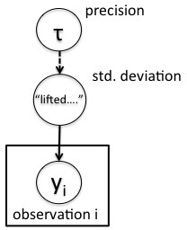

```{r chunksetup, include=FALSE} 
# include any code here you don't want to show up in the document,
# e.g. package and dataset loading
if(!('modules' %in% unlist(strsplit(getwd(), split = '/')))) setwd('modules')
library(methods)  # otherwise new() not being found - weird
library(nimble)
```

# Alternative parameterizations

BUGS uses fixed parameterizations and requires that distribution arguments be given in order.

NIMBLE allows you to use alternative parameterizations and allows you to give arguments by name in any order. 

Thus instead of needing to specify a normal distribution based on the precision you can use the standard deviation directly. For example if you wanted to follow Gelman (2006) in using a uniform prior on the standard deviation scale for the scale of a normal distribution, in BUGS or JAGS that would look like this:

```{r, prec, eval=FALSE}
precCode <- nimbleCode({
y ~ dnorm(mu, tau)
tau <- 1/(sigma*sigma)
sigma ~ dunif(0, 10)
})
```

In NIMBLE you can (and should) do this simply as:
```{r, sd, eval=FALSE}
sdCode <- nimbleCode({
y ~ dnorm(mu, sd = sigma)
sigma ~ dunif(0, 10)
})
```

NIMBLE uses the same default parameterization as the BUGS parameterization if you don't name your parameters. 

Under the hood, NIMBLE takes whatever parameterization is given and modifies the model to use NIMBLE's canonical parameterization, which is the parameterization used for actual calculations with the distribution. In the case of the normal distribution, this is the standard deviation. You can see the default parameterization, alternative parameterizations, and canonical parameterizations in Table 5.2 of the User Manual.  

# Lifted nodes: additional nodes inserted in the model

One implication of alternative parameterizations is that if you use a parameterization other than the canonical NIMBLE parameterization, NIMBLE will modify the structure of the model and insert a node in the model. We call this a *lifted node*. 

We can see this in the simple normal example.
```{r, precModel}
precCode <- nimbleCode({
for(i in 1:n) 
      y[i] ~ dnorm(0, tau)
tau ~ dgamma(1, 1)
})
precModel <- nimbleModel(precCode, inits = list(tau = 100),
          constants = list(n = 10))
precModel$getNodeNames()
```

Here the node called *lifted_d1_over_sqrt_oPtau_cP* is the standard deviation for *y*. That node is a deterministic function of *tau*:

Here's the DAG for this simple model, illustrating the lifted node.

<center></center>


# Lifted nodes: Best practices for model-generic programming

Because of the possibility of lifted nodes, it is important that programs be written to adapt to different model structures use NIMBLE’s systems for querying the model
graph. 


```{r, lifted-correct}
precModel$tau <- 0.0001
precModel$calculate(precModel$getDependencies('tau'))
# precModel$calculate() # would also work but recalculates entire model
precModel$simulate('y')
precModel$y
precModel$lifted_d1_over_sqrt_oPtau_cP
```

If one skips the calculate step and assumes the nodes are only those that appear in the BUGS code, one may not get correct results.


For example, here's incorrect usage that results in a bug.
```{r, lifted-bug}
precModel$tau <- 0.0001
precModel$simulate('y')
precModel$y
precModel$lifted_d1_over_sqrt_oPtau_cP # does not equal sqrt(1/precModel$tau)
```

Whoops, *y* was simulated based on the value of the lifted node, which was not updated based on the new value of *tau*. That's why the *y* values are  close to their mean of zero even though *tau* is very small. 


