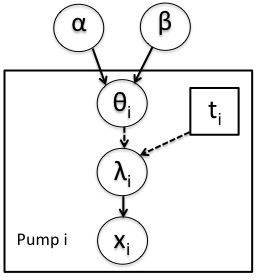

```{r chunksetup, include=FALSE} 
# include any code here you don't want to show up in the document,
# e.g. package and dataset loading
if(!('modules' %in% unlist(strsplit(getwd(), split = '/')))) setwd('modules')
library(methods)  # otherwise new() not being found - weird
library(nimble)
```

# Data nodes and constants

In BUGS and JAGS, constants such as the number of observations or groups, fixed covariate values, fixed indices for vectors, and data are all set as 'data'. 

In NIMBLE, we distinguish between true constants, which are quantities that are never changed, and must be provided when the model is defined, from *data* which is a label for the role a node plays in a model.

Nodes marked as data will by default be protected from any functions that would simulate over their values (though it is possible to change this behavior).

Let's work through an example using the pump model.

# Pump model

Here's the pump model, also used in some of the other modules.

<center></center>

```{r, pump-code}
```

# Setting data via *nimbleModel()*

We can set the data by passing the *data* argument to *nimbleModel()*.

```{r, data}
N <- 10
t <- c(94.3, 15.7, 62.9, 126, 5.24, 31.4, 1.05, 1.05, 2.1, 10.5)
x <- c(5, 1, 5, 14, 3, 19, 1, 1, 4, 22)
pumpConsts <- list(t = t, N = 10)
pumpData <- list(x = x)
pumpInits <- list(alpha = 1, beta = 1,
         theta = rep(0.1, pumpConsts$N))
pump <- nimbleModel(pumpCode, 
          data = pumpData, constants = pumpConsts, inits = pumpInits)
```

# Working with data nodes

As discussed, we can set data values, but we cannot simulate into a data node. 

```{r, data-manip}
Now let's look
pump$isData('x')
pump$x
pump$simulate('x')
pump$x
pump$resetData()
pump$isData('x')
pump$x
pump$simulate('x')
pump$x
```

For compatibility with BUGS
and JAGS, NIMBLE allows both to be provided in the the constants
argument to *nimbleModel()*, in which case NIMBLE determines which are
which, based on which variables appear on the left-hand side of BUGS
declarations.


# Data nodes and missing values

Now let's see how missing values can be handled. In the usual Bayesian paradigm, missing data are just considered to be parameters.

```{r, missing}
pumpData2 <- pumpData
pumpData2$x[3] <- NA
pump$setData(pumpData2)
pump$isData('x')
```

If we set up an MCMC, we see that a sampler (an *end* sampler, which just means sampling a node that hangs off the model graph, with no dependents) is assigned to `x[3]`.

```{r, missing-mcmc}
conf <- configureMCMC(pump)
conf$getSamplers()[13]
```

