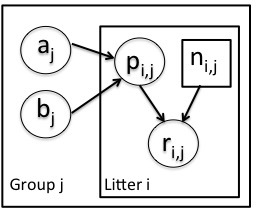
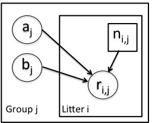

```{r chunksetup, include=FALSE} 
# include any code here you don't want to show up in the document,
# e.g. package and dataset loading
if(!('modules' %in% unlist(strsplit(getwd(), split = '/')))) setwd('modules')
library(methods)  # otherwise new() not being found - weird
library(nimble)
```

# Introduction

Here we'll work through an extended example of customizing an MCMC (and considering maximum likelihood via MCEM) for a tricky, but simple, example model.

The example is the *litters* example from the original BUGS examples, available with NIMBLE in the *classic-bugs/vol1/litters* directory of the installed package (call ```searchpaths()``` after loading the NIMBLE package to find where this directory is).

# Litters model

Here's the original litters model. There are $G=2$ groups of rat litters, with $N=16$  litters (i.e., mothers) in each group, and a variable number of pups in each litter. Survival of the pups in a litter is governed by a survival probability for each litter, $p_{i,j}, but the probabilities for the litters within a group are considered to come from a common distribution, thereby borrowing strength across the litters in a group.

<center></center>


Here's the BUGS code.

```{r, model}
code <- nimbleCode({
  for (i in 1:G) {
     for (j in 1:N) {
     	 # likelihood (data model)
        r[i,j] ~ dbin(p[i,j], n[i,j])
	# latent process (random effects)
        p[i,j] ~ dbeta(a[i], b[i]) 
     }
     # prior for hyperparameters
     a[i] ~ dgamma(1, .001)
     b[i] ~ dgamma(1, .001)
   }
})
```


# Set up the model

```{r, model-build}
consts <- list(G = 2,N = 16, n = matrix(c(13, 12, 12, 11, 9, 10, 
       9, 9, 8, 11, 8, 10, 13, 10, 12, 9, 10, 9, 10, 5, 9, 9, 13, 
       7, 5, 10, 7, 6, 10, 10, 10, 7), nrow = 2))
data = list(r = matrix(c(13, 12, 12, 11, 9, 10, 9, 9, 8, 10, 8, 9, 
     12, 9, 11, 8, 9, 8, 9, 4, 8, 7, 11, 4, 4, 5, 5, 3, 7, 3, 7, 0), 
     nrow = 2))
inits <- list( a = c(2, 2), b=c(2, 2) )
model <- nimbleModel(code, constants = consts, data = data, inits = inits)
```

# Basic MCMC

Here's NIMBLE's default MCMC.

```{r, default, fig.height=5, fig.width=12}
thin <- 10
conf <- configureMCMC(model, thin = thin)
# thinning _only_ to reduce time of plotting 
#  (thinning is proven to always reduce efficiency in parameter estimation)
conf$addMonitors(c('a', 'b', 'p'))
mcmc <- buildMCMC(conf)

Cmodel <- compileNimble(model)
Cmcmc <- compileNimble(mcmc, project = model)

niter <- 10000
set.seed(0)
system.time(Cmcmc$run(niter))

smp_basic <- as.matrix(Cmcmc$mvSamples)

tsplot <- function(x, ...) plot(seq_along(x), x, type = 'l', ...)

par(mfrow = c(1, 4))
tsplot(smp_basic[ , 'a[1]'], main = expression(a[1]), xlab = '', ylab = 'default')
tsplot(smp_basic[ , 'b[1]'], main = expression(b[1]), xlab = '', ylab = '')
tsplot(smp_basic[ , 'a[2]'], main = expression(a[2]), xlab = '', ylab = '', ylim = c(0,20))
tsplot(smp_basic[ , 'b[2]'], main = expression(b[2]), xlab = '', ylab = '', ylim = c(0,6))

library(coda)
nBurn <- niter / 5
postBurn <- (nBurn:niter) / thin
effectiveSize(as.mcmc(smp_basic[postBurn, ]))
```


# Blocking the hyperparameters

Given the posterior correlation between the hyperparameters for each group, an obvious first step is to try (separate) block samplers on $(a_1,b_1)$ and $(a_2, b_2)$.

```{r, hyp-block, fig.height=5, fig.width=12}
conf$removeSamplers(c('a', 'b'))
conf$addSampler(c('a[1]', 'b[1]'), 'RW_block')
conf$addSampler(c('a[2]', 'b[2]'), 'RW_block')

mcmc <- buildMCMC(conf)
Cmcmc <- compileNimble(mcmc, project = model, resetFunctions = TRUE)

nimCopy(model, Cmodel)  # reinitialize

niter <- 10000
set.seed(0)
system.time(Cmcmc$run(niter))

smp_hyp_block <- as.matrix(Cmcmc$mvSamples)

par(mfrow = c(1, 4))
tsplot(smp_hyp_block[ , 'a[1]'], main = expression(a[1]), xlab = '', ylab = 'default')
tsplot(smp_hyp_block[ , 'b[1]'], main = expression(b[1]), xlab = '', ylab = '')
tsplot(smp_hyp_block[ , 'a[2]'], main = expression(a[2]), xlab = '', ylab = '', ylim = c(0,20))
tsplot(smp_hyp_block[ , 'b[2]'], main = expression(b[2]), xlab = '', ylab = '', ylim = c(0,6))

effectiveSize(as.mcmc(smp_hyp_block[postBurn, ]))
```

# Blocking the random effects too

But perhaps we should have blocked the hyperparameters with their dependent random effects. This is how one could do that, though $a$, $b$, and $p$ are on very different scales, which may cause problems, particularly at the start of an adaptive sampler. As we see in the trace plots, this strategy is not working at all.

```{r, effects-block, fig.height=5, fig.width=12}
conf$removeSamplers(c('a', 'b', 'p'))
group1nodes <- model$getDependencies(c('a[1]', 'b[1]'), stochOnly = TRUE)
group2nodes <- model$getDependencies(c('a[2]', 'b[2]'), stochOnly = TRUE)
conf$addSampler(group1nodes, 'RW_block')
conf$addSampler(group2nodes, 'RW_block')

mcmc <- buildMCMC(conf)
Cmcmc <- compileNimble(mcmc, project = model, resetFunctions = TRUE)

niter <- 10000
nimCopy(model, Cmodel)  # reinitialize

set.seed(0)
system.time(Cmcmc$run(niter))

smp_full_block <- as.matrix(Cmcmc$mvSamples)

par(mfrow = c(1,4))
tsplot(smp_full_block[ , 'a[1]'], main = expression(a[1]), xlab = '', ylab = 'default')
tsplot(smp_full_block[ , 'b[1]'], main = expression(b[1]), xlab = '', ylab = '')
tsplot(smp_full_block[ , 'a[2]'], main = expression(a[2]), xlab = '', ylab = '', ylim = c(0,20))
tsplot(smp_full_block[ , 'b[2]'], main = expression(b[2]), xlab = '', ylab = '', ylim = c(0,6))
```

More generally, in any model, we might ask if we have the ideal blocking structure? Even in simple models, there is a combinatorial explosion of possible blocks. Sometimes we have some intuition and can do this manually, but sometimes that is a lot of work.

# Automated blocking

The NIMBLE developers have developed a procedure for automated blocking in MCMC, based on considering the posterior correlation of all parameters in initial trial runs of the MCMC, as discussed [here](http://arxiv.org/abs/1503.05621).

Let's try automated blocking for this model.

```{r, autoBlock}
auto <- autoBlock(model, autoIt = 10000, run = list())
confAuto <- auto$conf
mcmc <- buildMCMC(confAuto)
```

Given how similar the blocking is to simply blocking the hyperparameters, we won't bother trying it here, but it's easy to do since *autoBlock()* returns an MCMC configuration argument that can be fed into buildMCMC.

# Integrating over the random effects: user-defined distribution

One common cause of poor MCMC performance is dependence across the levels of a model, such as between hyperparameters and the random effects that depend on those hyperparameters. Such dependence may not be effectively addressed using simple blocking.

When one has conjugacy, as in this case for the $p$ parameters, one can always analytically integrate over those parameters in the model. By reducing dimensionality this can often improve MCMC efficiency though it removes conjugacy, which can also hurt. 

Here's the graph for the model after integrating over the $p$ parameters.

<center></center>

One of the major drawbacks is the need to do the integration, which users not familiar with probability may not be able to do easily. That said, let's consider it in this example, by using a user-defined *beta-binomial* distribution. This is the distribution for *y* that results from integrating over *p*.

Actually, given that the module on user-defined distributions provides a Dirichlet-multinomial distribution and the beta-binomial distribution is the special case of that with only two categories, we could just borrow that code. See the module user_dist for details and sample code.

# Implicitly integrating over the random effects: cross-level sampler

An easier alternative to analytically integrating over the random effects is to use a computational trick that mathematically achieves the same result.

The idea of what we call the *cross-level sampler* is:

  -  do a blocked Metropolis random walk on one or more hyperparameters and then a conjugate update of the dependent nodes conditional on the proposed hyperparameters, accepting/rejecting everything together
  - this amounts to a joint update of the hyperparameters and their dependent nodes
  - equivalent to analytically integrating over the dependent nodes

```{r, cross-level, fig.height=5, fig.width=12}
conf$removeSamplers(c('a', 'b', 'p'))
conf$addSampler(c('a[1]', 'b[1]'), 'crossLevel')
conf$addSampler(c('a[2]', 'b[2]'), 'crossLevel')

mcmc <- buildMCMC(conf)
Cmcmc <- compileNimble(mcmc, project = model, resetFunctions = TRUE)

niter <- 10000
nimCopy(model, Cmodel)  # reinitialize
set.seed(0)
system.time(Cmcmc$run(niter))

smp_cross <- as.matrix(Cmcmc$mvSamples)

par(mfrow = c(1,4))
tsplot(smp_cross[ , 'a[1]'], main = expression(a[1]), xlab = '', ylab = 'default')
tsplot(smp_cross[ , 'b[1]'], main = expression(b[1]), xlab = '', ylab = '')
tsplot(smp_cross[ , 'a[2]'], main = expression(a[2]), xlab = '', ylab = '', ylim = c(0,20))
tsplot(smp_cross[ , 'b[2]'], main = expression(b[2]), xlab = '', ylab = '', ylim = c(0,6))

effectiveSize(as.mcmc(smp_cross[postBurn, ]))
```

# Using MCEM 

We might also be interested in an empirical Bayes (maximum likelihood for the hyperparameters) analysis. This can be done by Monte Carlo Expectation Maximization, an algorithm that integrates over the random effects numerically using an MCMC sampler for the random effects embedded within an optimization over the hyperparameters. 

```{r, mcem}
# currently an issue with running MCEM on the same model as an MCMC
# so create new copy of model
model2 <- model$newModel()   
inits <- list( a = c(12, 12), b=c(12, 12) )
model2$setInits(inits)
mcem <- buildMCEM(model2, latentNodes = 'p', burnIn = 250, 
     optimMethod = 'Nelder-Mead')
print(system.time(   # takes a while:
        out <- mcem(maxit = 100)
))
out 
```

The MCEM is converging quite slowly. In this case, since we can analytically integrate over $p$, we can directly maximize the marginal likelihood and see that the MLE for the first group is $\hat{a_1}=43.5$, $\hat{b_1}=4.94$. Basically, slow convergence in the optimization is caused by the same issue as the strong dependence in the posterior.

One option would be to reparameterize the model from the $a,b$ parameterization to the mean and standard deviation of the beta distribution. That's easy in NIMBLE, since we provide that parameterization as an alternative parameterization!

# MCEM with reparameterization 

Here we use NIMBLE's alternative parameterizations to directly represent the beta distribution in terms of mean and standard deviation. Convergence appears to be faster to the MLE of $\hat\mu=0.898$ and $\hat\sigma=0.043$, but we'd need to investigate further. Also, at present NIMBLE's MCEM does not handle stopping criteria, but there will be enhancements in the next release (0.5-1). 

```{r, mcem-reparam}
codeReparam <- nimbleCode({
  for (i in 1:G) {
     for (j in 1:N) {
        r[i,j] ~ dbin(p[i,j], n[i,j]);
        p[i,j] ~ dbeta(mean = mu[i], sd = sigma[i]) 
     }
     mu[i] ~ dunif(0, 1)
     sigma[i] ~ dunif(0, 1)
   }
})
inits <- list( mu = c(.5, .5), sigma = c(.1, .1))
modelReparam <- nimbleModel(codeReparam, constants = consts, data = data, 
             inits = inits)
mcemReparam <- buildMCEM(modelReparam, latentNodes = 'p', burnIn = 250, 
            optimMethod = 'Nelder-Mead')
print(system.time(
        outReparam <- mcemReparam(maxit = 20)
))
outReparam 
```


