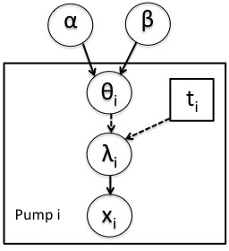

Using BUGS Models
==========================
NIMBLE training materials module
---------------------------------
Nimble Development Team

```{r chunksetup, include=FALSE} 
# include any code here you don't want to show up in the document,
# e.g. package and dataset loading
if(!('modules' %in% unlist(strsplit(getwd(), split = '/')))) setwd('modules')
library(methods)  # otherwise new() not being found - weird
library(nimble)
```


# The BUGS language

The BUGS language is described in detail in the [relevant section of the BUGS manual](http://www.openbugs.net/Manuals/ModelSpecification.html). Information on how Nimble's 'dialect' of BUGS differs from the original and information on the distributions and functions provided in Nimble can be found in Section 5 of the [Nimble Users Manual](http://r-nimble.org/manuals/NimbleUserManual.pdf).

Basically, one specifies the variables in the hierarchical model as lines of code.
  - stochastic nodes (data and parameters) are indicated with `~`
  - deterministic nodes (which are deterministic functions of other nodes and of constants) are indicated by `<-`.

There are lots of example models from the classic BUGS examples provided in the classic-bugs directory of the installed Nimble R package or from the [JAGS website](https://sourceforge.net/projects/mcmc-jags/files/Examples/).  Information about the models can be found in [Volume 1](http://www.mrc-bsu.cam.ac.uk/wp-content/uploads/WinBUGS_Vol1.pdf), [Volume 2](http://www.mrc-bsu.cam.ac.uk/wp-content/uploads/WinBUGS_Vol2.pdf), and [Volume 3](http://www.mrc-bsu.cam.ac.uk/wp-content/uploads/WinBUGS_Vol3.pdf) of the WinBUGS example manuals.

# A basic example

Here we'll give a simple example of building a model. Other modules will show how one can fit the model and give more detail on various features of Nimble.

We'll use the *pump* model example from BUGS. The data set
  describes failure times of some pumps.  

<center></center>

In this model, there are $N=10$ pumps. The number of failures, $x_i$, for pump $i$ is assumed to follow a Poisson distribution, with mean $\lambda_i = \theta_i \cdot t_i$ where $t_i$ is the length of operation of the pump in thousands of hours and $\theta_i$ is the failure rate. The model then borrows strength across pumps with an exchangeable prior, $\theta_i \sim \mbox{Gamma}(\alpha, \beta)$. $\alpha$ and $\beta$ are the hyperparameters of this random effects distribution. 

# Specifying the BUGS code for a model

Here we specify the pump code directly in R. We can walk through some of details via the comments in the BUGS code.

```{r model-code}
library(nimble)
pumpCode <- nimbleCode({ 
  for (i in 1:N){

      # likelihood (data model)
      x[i] ~ dpois(lambda[i])

      # latent process (random effects)
      # linear predictor      
      lambda[i] <- theta[i]*t[i]
      # random effects distribution
      theta[i] ~ dgamma(alpha,beta)
  }
  # priors on hyperparameters
  alpha ~ dexp(1.0)
  beta ~ dgamma(0.1,1.0)
})
```


You can also load it directly from the standard BUGS example file formats (see `help(readBUGSmodel)`).

# Building a model in Nimble

In BUGS or JAGS, one would provide the model code, input data and constant values, and (optionally) initial parameter values and the software would directly create and run an MCMC, returning the results to you.

In Nimble, you have more fine-grained control over these steps. The first step is to build an R representation of the model.

```{r build-model}
N <- 10
t <- c(94.3, 15.7, 62.9, 126, 5.24, 31.4, 1.05, 1.05, 2.1, 10.5)
x <- c(5, 1, 5, 14, 3, 19, 1, 1, 4, 22)
pumpConsts <- list(t = t, N = 10)
pumpData <- list(x = x)
pumpInits <- list(alpha = 1, beta = 1,
         theta = rep(0.1, pumpConsts$N))
pump <- nimbleModel(pumpCode, 
          data = pumpData, constants = pumpConsts, inits = pumpInits)
```

If all you want to do is run an MCMC, Nimble's fine-grained control might not be so interesting to you. But by providing an explicit model object, we allow you to operate the model and program with it.

# Inspecting the model

What are the variables in the model? What are the dependencies of a given node (this is information used in many algorithms)?

```{r, model-nodes}
pump$getNodeNames()
hypers <- pump$getNodeNames(topOnly = TRUE)
hypers
pump$getDependencies(hypers)
```

What's the current value in a node or the value of the log probability density for that node?

```{r, model-values}
pump$x  
pump$logProb_x  # log-likelihood components
pump$getLogProb('x') # log-likelihood
pump$lambda
pump$theta
pump$getLogProb('theta')  # log-prior for random effects
```

# Operating the model: *calculate()* and *simulate()*

We have control over the model. In particular, for every node, Nimble provides *calculate()* and *simulate()* functions that calculate the current probability density value for the node and simulate a new value for the node from its distribution (given only parent nodes). These operations lie at the heart of many algorithms. 

Let's change values in the model and recalculate the density values. As we'll discuss in a later module, Nimble sometimes introduces hidden nodes not specified in the model, so when calculating probabilities, it's best to ask Nimble to do so based on the dependencies of the altered node.

```{r, model-operate}
pump$alpha <- 0.5
pump$calculate(pump$getDependencies('alpha'))   # or calculate(pump, ...)
pump$getLogProb('theta')  # equivalent to pump$logProb_theta or getLogProb(pump, 'theta')
```
 
If we want to simulate (from the prior), we can do that too.

```{r, model-simulate}
set.seed(0)  # so the calculations are reproducible
pump$simulate('theta')  # simulate from prior
pump$theta
pump$getLogProb('theta')  # log prob not yet updated!
pump$calculate('theta')   # update it
getLogProb(pump, 'theta')  # now we're good
pump$lambda  # again, not updated
pump$calculate(pump$getDependencies('theta'))  # recalculate dependents
pump$lambda
```

**Question**: The Nimble developers chose to not automatically recalculate density values when a node's value changes nor deterministic dependent nodes when a parent node changes. What are the design considerations in making that choice?

# Setting data values and initial values

In Nimble, you can change data and parameter values at any time. Further, you don't need to set values when you use *nimbleModel()* to create the model. Any missing values will just be set to `NA`. Nodes with data have a special status as *data nodes*, which means that values in those nodes will not be overwritten, unless explicitly requested (e.g., when calling *simulate()*
on a model).

```{r, model-set}
pump$x
pump$theta
pump$simulate(c('x', 'theta'))
pump$x
pump$theta
```

As an example of setting data values, suppose we had a different set of data values and wanted to use those.

```{r, model-newdata}
pumpDataNew <- list(x = c(12, 7, 18, 1, 3, 5, 11, 2, 22, 9))
pump$setData(pumpDataNew)
pump$x
```

One could have instead, simply assigned into `x`, but it's good practice to use `setData()`, which in addition to setting the values, also configures the model so that the data values, being considered fixed in a given model, are not overwritten when using algorithms with the model. 

To change initial values for parameters you can use *setInits()* or simply assign values into the appropriate nodes, as we've already seen.

```{r, model-inits}
pump$setInits(list(alpha = 2, beta = 0.5))
```

# Use cases for data node functionality

Nimble's developers made the design choice that users being to change data values and also whether  whether a node is treated as a fixed data value or an unknown parameter.

Some potential uses of this functionality include:

 - bootstrapping, jackknife, etc.
 - simulation studies
 - assessment of sensitivity to outliers
 - cross-validation and predictive calculations
 - others?

# Compiling the model for faster operation

To use a model in practice, we'd want a compiled version of the model for fast calculations. In the context of Nimble, *compilation* means generating C++ code, compiling that code, and loading it back into R as an R object that can be used exactly (with few exceptions) like the uncompiled model.

```{r compile-model}
Cpump <- compileNimble(pump)
pump$theta
Cpump$theta
Cpump$simulate('theta')
Cpump$theta
pump$theta
```

# A very basic MCMC

The steps of running an MCMC are as follows:

 - configure the MCMC
 - build the MCMC
 - compile a C++ version of the MCMC
 - run the MCMC
 - assess and use the MCMC samples

```{r, mcmc}
# configure the MCMC and determine which samples to save
pumpConf <- configureMCMC(pump, print = TRUE)
pumpConf$addMonitors(c('alpha', 'beta', 'theta'))
# build the MCMC
pumpMCMC <- buildMCMC(pumpConf)
# compile a C++ version
CpumpMCMC <- compileNimble(pumpMCMC, project = pump)
# run the MCMC
niter <- 1000
set.seed(0)
CpumpMCMC$run(niter)
# get the samples as an R matrix
samples <- as.matrix(CpumpMCMC$mvSamples)
```

At this point you can what you'd normally do with posterior samples, including create a *coda* *mcmc* object for evaluating MCMC performance.

# Exercises

1) Write BUGS code for a normal random effects model with 6 groups and 10 observations in each group. You'll need multiple variance components.

2) Set the hyperparameters (the variance components) for the model and simulate the random means and observations. Now fix the data nodes as 'data'. See what happens if you try to use *simulate()* on the data nodes. 

3) Calculate the full density of the model. Next calculate just the log-likelihood.

4) Compile the model and compare the time of calculating the full density in the compiled C++ model to the original R version of the model. (It may not be much different here for such a small model). You could use *system.time()* or for this comparison of a very fast calculation, *microbenchmark()* in the  *microbenchmark* package is likely to be more helpful.
