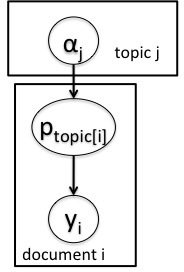

```{r chunksetup, include=FALSE} 
# include any code here you don't want to show up in the document,
# e.g. package and dataset loading
if(!('modules' %in% unlist(strsplit(getwd(), split = '/')))) setwd('modules')
library(methods)  # otherwise new() not being found - weird
library(nimble)
```

# Introduction

NIMBLE provides a variety of distributions, as seen in Section 5.2.3 of the [NIMBLE manual](http://r-nimble.org/manuals/NimbleUserManual.pdf). 

However, there are lots of other probability distributions out there that you might want to use. So NIMBLE allows you to code up your own distribution and then use it in BUGS code.

Furthermore, in some cases one can use a user-defined distribution as a way to reduce computation by analytically integrating over a component of the model.

# Basic example

To illustrate, suppose that NIMBLE did not provide an exponential distribution. Here's what you would do to code up your own exponential distribution and make it available in BUGS code.

First we write nimbleFunctions for the density and simulation functions. Note the naming is analogous to how probability distributions are handled in R. 

  - The 'd' function should have *log* as its last argument, a binary argument for whether the log density is returned or not. 
  - The 'r' function should have *n* as its first argument but need only work for ```n=1```.

```{r, dmyexp}
dmyexp <- nimbleFunction(
    run = function(x = double(0), rate = double(0, default = 1), 
        log = integer(0, default = 0)) {
        returnType(double(0))
        logProb <- log(rate) - x*rate
        if(log) return(logProb)
        else return(exp(logProb)) 
    })

rmyexp <- nimbleFunction(
    run = function(n = integer(0), rate = double(0, default = 1)) {
        returnType(double(0))
        if(n != 1) print("rmyexp only allows n = 1; using n = 1.")
        dev <- runif(1)
        return(-log(1-dev) / rate)
    })
```

```{r, scopefix, echo=FALSE}
# not clear why dmyexp() not being put into global
# if this isn't done, registerDistributions fails to find dmyexp in knitr
assign('dmyexp', dmyexp, .GlobalEnv)
assign('rmyexp', rmyexp, .GlobalEnv)
```

The User Manual also shows how you could write CDF ('p') and inverse CDF ('q') such that you could make use of truncation with your distribution, but for standard usage all you need is the density ('d') and simulation ('r') functions.

# Registering your new distribution

```{r, register-dist}
registerDistributions(list(
        dmyexp = list(
               BUGSdist = "dmyexp(rate, scale)",
               Rdist = "dmyexp(rate = 1/scale)",
               altParams = c("scale = 1/rate", "mean = 1/rate"),
               pqAvail = FALSE,
               range = c(0, Inf)
               )))
```

This makes NIMBLE aware of the distribution as a BUGS distribution. 

Comments: 

  - If you want to allow users to use different parameterizations for the distribution, you can do this via the *Rdist* element. Here we allow use of *scale*, with the conversion from *scale* to the canonical *rate* specified.
  - The *altParams* information can be used in NIMBLE's MCMC conjugacy system and sequential Monte Carlo system but is not required.

# Using the distribution

```{r, use-dist}
code <- nimbleCode({
y ~ dmyexp(scale = mu)
mu ~ dunif(0, 10)
})
m <- nimbleModel(code, data = list(y = 1.2))
mcmcConf <- configureMCMC(m)
mcmcConf$getSamplers()
mcmc <- buildMCMC(mcmcConf)
niter <- 100
mcmc$run(niter)
plot(seq_len(niter), as.matrix(mcmc$mvSamples)[,1], type = 'l')
```

# A more interesting example

While educational, the exponential example is not particularly interesting given NIMBLE already provides that distribution.  Let's consider an example where using a user-defined distribution can improve MCMC performance (run time and sampling efficiency).

When working with multinomial data, the Dirichlet distribution can be used to relate the probability vector in the multinomial to covariates and to induce over-dispersion.

One context in which this comes up is topic modeling. You might have textual data from multiple documents, with each document being about a topic. The probabilities of words in each document in a topic can be represented as being a sample from a Dirichlet distribution for that topic.  

# Basic topic model 

A (very) basic model might look like this.

<center></center>

```{r, multi}
code <- nimbleCode({
for(i in 1:n) {
  # likelihood - word counts
  y[i, 1:K] ~ dmulti(p[i,1:K], N[i])
  # latent process (random effects) - topic model
  p[i, 1:K] ~ ddirch(alpha[topic[i], 1:K])
}
# prior for hyperparameters
for(tp in 1:M)
  for(k in 1:K)
  alpha[tp, k] ~ dunif(0, 100)
})

const <- list(M = 2, K = 4, n = 5, N = rep(1000, 5),
      topic = c(1, 1, 1, 2, 2))
alphaInits <- rbind(c(10, 30, 100, 3), c(12, 15, 15, 8))
m <- nimbleModel(code, constants = const, 
  inits = list(alpha = alphaInits))
```

Note that with those $\alpha$ values, the third word is very common in topic 1, while in topic 2, the second and third words are equally common. 

```{r, multi-simulate}
set.seed(0)
m$simulate(c('p', 'y'))
m$p
m$y
```


# The Dirichlet-multinomial distribution

Those of you familiar with Gibbs sampling may recognize that with a multinomial likelihood and Dirichlet prior, you can analytically integrate over $p[topic,]$ for all topics. This eliminates a layer in the model and should improve MCMC performance by reducing dependence amongst the model parameters and by simply reducing the number of parameters needing to be sampled.

Integrating over the proportions gives the Dirichlet-multinomial distribution, whose [density](https://en.wikipedia.org/wiki/Dirichlet-multinomial_distribution#For_a_multinomial_distribution_over_category_counts) involves a heap of gamma functions. 

# Dirichlet-multinomial nimbleFunctions

Here's how we'd write the density ('d') and simulation ('r') nimbleFunctions for this distribution. 

Note that in this example we have that the random variable and the parameter are one-dimensional arrays (vectors), so we need to indicate that.

```{r, dirchmulti}
ddirchmulti <- nimbleFunction(
            run = function(x = double(1), alpha = double(1), size = double(0),
                log = integer(0, default = 0)) {

                returnType(double(0))
                logProb <- lgamma(size) - sum(lgamma(x)) + 
                        lgamma(sum(alpha)) -
                        sum(lgamma(alpha)) + sum(lgamma(alpha + x)) - 
                        lgamma(sum(alpha) + size)
                if(log) return(logProb)
                        else return(exp(logProb))
})

rdirchmulti <- nimbleFunction(
            run = function(n = integer(0), alpha = double(1), 
                size = double(0)) {

                returnType(double(1))
                if(n != 1) print("rdirchmulti only allows n = 1; using n = 1.")
                p <- rdirch(1, alpha)
                return(rmulti(1, size = size, prob = p))
})
```

```{r, scopefix2, echo=FALSE}
# not clear why ddirchmulti() not being put into global
# if this isn't done, registerDistributions fails to find ddirchmulti in knitr
assign('ddirchmulti', ddirchmulti, .GlobalEnv)
assign('rdirchmulti', rdirchmulti, .GlobalEnv)
```

```{r, register-dirchmulti}
registerDistributions(list(
        ddirchmulti = list(
        BUGSdist = "ddirchmulti(alpha, size)",
        types = c('value = double(1)', 'alpha = double(1)'))
))
```

# Using the user-defined distribution

We can now rewrite the topic model as follows. We won't apply this to a real dataset, but one could now use this rewritten model in an algorithm such as MCMC, as in one of the exercises.

```{r, dirmulti-topic}
code2 <- nimbleCode({
for(i in 1:n)
  # likelihood 
  y[i,1:K] ~ ddirchmulti(alpha[topic[i], 1:K], N[i])
# priors for hyperparameters
for(tp in 1:M)
  for(k in 1:K)
  alpha[tp, k] ~ dunif(0, 100)
})
m2 <- nimbleModel(code2, constants = const,
  inits = list(alpha = alphaInits))
set.seed(0)
m2$simulate('y')
m2$y
```


# Final thoughts

In real document analysis, you would want to infer topics for unlabelled documents. This would require having discrete variables be the random (unknown) indices of $\alpha$ that indicate the unknown topic of each such document, but at the moment, NIMBLE does not allow for random indices. 

Also, a standard model for topic analysis, called *latent Dirichlet allocation*, allows each document to be a mixture of topics. One could expand the code here to allow for that. 


